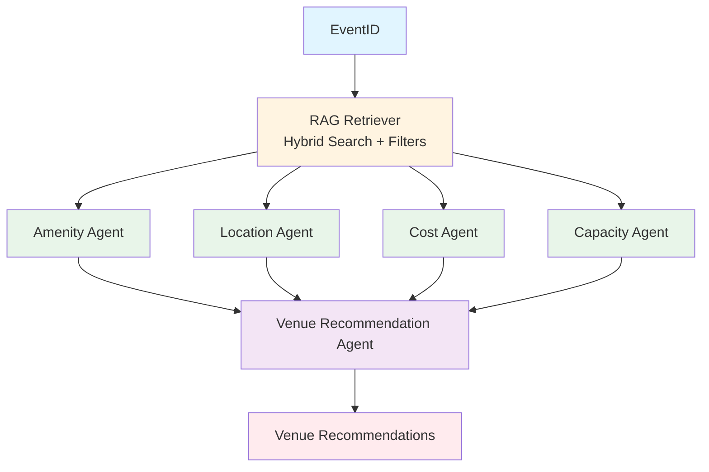

# Event Venue Recommendation


## System Flow




## Indexing Documents

We index `event_history.json` as follows:

### 1. Document Creation

Each event from `event_history.json` is transformed into a `Document` object with:

- **Page Content**: Composite text embedding created by `create_event_embedding_text()` that includes:
  - Event ID, name, type, attendee count
  - Client name, venue ID, venue name, city
  - Key requirements, requirements met
  - Success factors, challenges
  - Positive/negative feedback
  - Notes and outcome

- **Metadata**: Nested structure matching `mappings.json` schema:

  ```json
  {
    "event": {
      "event_id": "...",
      "event_name": "...",
      "attendee_count": 280,
      "venue_id": "...",
      "city": "...",
      "total_cost": 75000,
      "client_rating": 4.7,
      ...
    },
    "client": {
      "client_id": "...",
      "company_name": "...",
      "industry": "...",
      ...
    },
    "venue": {
      "venue_id": "...",
      "name": "...",
      "max_capacity": 500,
      "amenities": [...],
      ...
    }
  }
  ```

### 2. Embedding Generation

- Uses OpenAI `text-embedding-3-small` model (1536 dimensions)
- Each document's `page_content` is embedded into a vector representation
- Embeddings capture semantic meaning of event-venue match patterns

### 3. OpenSearch Indexing

- Documents are bulk-indexed to OpenSearch using `OpenSearchVectorSearch.afrom_documents()`
- Index name: `venue_recommendations` (configurable via `config.opensearch.index_name`)
- Uses FAISS engine with HNSW algorithm for approximate nearest neighbor search
- Index settings: `ef_construction=256`, `m=48`, `ef_search=512`

### 4. Enrichment

- Client profiles from `client_profiles.json` are merged into metadata
- Venue details from `venues.json` are merged into metadata
- Missing client/venue profiles are handled gracefully (set to `None`)

## Searching Documents

### 1. Query Construction

The search query is built from event requirements using `_build_query()`:

- Event ID, name, type, attendee count
- Location preference and location requirements
- Key requirements, required/preferred amenities
- Event style, special requirements, client preferences

### 2. Hybrid Search Strategy

The system uses **vector similarity search** combined with **structured filters**:

#### Vector Search

- Semantic similarity search using the query embedding
- Finds historically similar events based on event characteristics
- Returns top `k` most similar documents (default: 10)

#### Filtering

Filters are applied using `efficient_filter` in OpenSearch:

**a) Attendee Count Filter:**

- Filters venues by `metadata.venue.max_capacity`
- Applies ±20% tolerance or minimum ±50 attendees for flexibility
- Example: For 250 attendees, searches venues with capacity 200-300 (or 200-300 if ±50 is larger)

**b) Location Cities Filter:**

- Keyword prefix search on `metadata.venue.city.keyword`
- Matches any city from `location_requirements.cities`
- Extracts city name (handles "City, State" format)
- Uses `bool.should` with `minimum_should_match: 1`

### 3. Search Execution

```python
retrieved_documents = await vectorstore.asimilarity_search(
    query=query,
    k=k,
    search_type="approximate_search",
    efficient_filter=filter_clause
)
```

### 4. Results

- Returns `List[Document]` containing similar historical events
- Each document includes full event details, client profile, and venue metadata
- Documents are deduplicated by `venue_id` before agent processing

## Agent Orchestration

### 1. Parallel Agent Execution

All four specialized agents run **concurrently** using `asyncio.gather()`:

- **Amenity Matching Agent**: Analyzes amenity requirements vs venue offerings
- **Location Agent**: Evaluates geographic fit, accessibility, nearby accommodations
- **Cost Analysis Agent**: Assesses budget fit, value, hidden costs
- **Capacity & Space Agent**: Evaluates attendee fit, room layouts, breakout spaces

### 2. Error Handling & Recovery

- Each agent tracks its status (`AgentStatus.SUCCESS` or `AgentStatus.FAILURE`)
- Failed agents are automatically retried up to **3 times** using `_retry_agent()`
- System continues processing even if individual agents fail
- Failed agents are excluded from final recommendations if all retries fail

### 3. Result Aggregation

- Successful agent results are collected into a `recommendations` dictionary
- Results are keyed by agent type: `amenity`, `location`, `cost`, `capacity`
- Only successful analyses are passed to the supervisor agent

### 4. Supervisor Synthesis

The **VenueRecommendationAgent** (supervisor) receives:

- All successful agent analyses
- Similar events from RAG retrieval
- Event requirements
- Number of venues to recommend (`top_n`)

The supervisor:

- Validates and synthesizes all analyses
- Ranks venues based on combined scores
- Prioritizes capacity and location analysis
- Provides strengths and considerations for each venue
- Returns final ranked recommendations

### 5. Output Format

Final recommendations include:

- `venue_id` and `venue_name`
- `ranking` (1 to top_n)
- `estimated_cost`
- `analysis` (synthesized from all agents)
- `strengths` (list of positive aspects)
- `considerations` (list of potential concerns)
